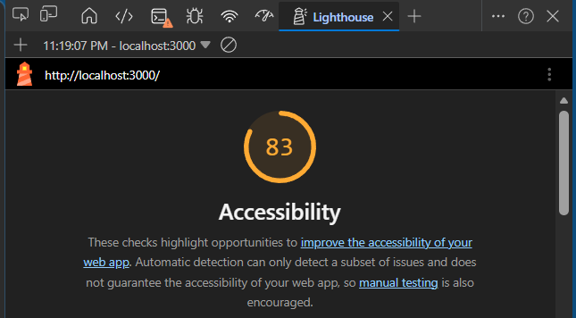

# ReactPortfolio-template

- changelog
  - 05.19
    - edited basic hero landing info.
    - added project screenshots folders.
  - 05.25
    - commented out `<a>` that references template on github in `Header.jsx`.
    - updated `titles` and `devicon`'s in `portfolio_shared_data`.
    - created `Cerifications.js` and added as plaveholder in `Home.js`.
    - edited `experience` and added more to `decription`, as well as added `certifications` inside of `res_primaryLanguage.json`.
    - created class `Certifications` inside `Certifications.js`; imported into `Home.js`.
    - broken linkedin link; need to fix.
    - passed `certifications` and `basic_info` as props through `<Certifications />` within `Home.js`.
    - Inside `Certifications.js`, defined `sectionName` and `certifications` variables to render content.
    - updated `section_name` in `res_primaryLanguage.json` to include `"certifications": "Certifications"`.
    - Lighthouse accessibility test 
    - created `projectsUpdate` branch.
  - 05.26
    - updated pictures.
    - fixed linkedin link.
    - updated project details in `res_primaryLanguage.json`.
    - commented on section in `Footwr.js` used for secondary language.
    - updated link to devicons in `index.html`
    - 